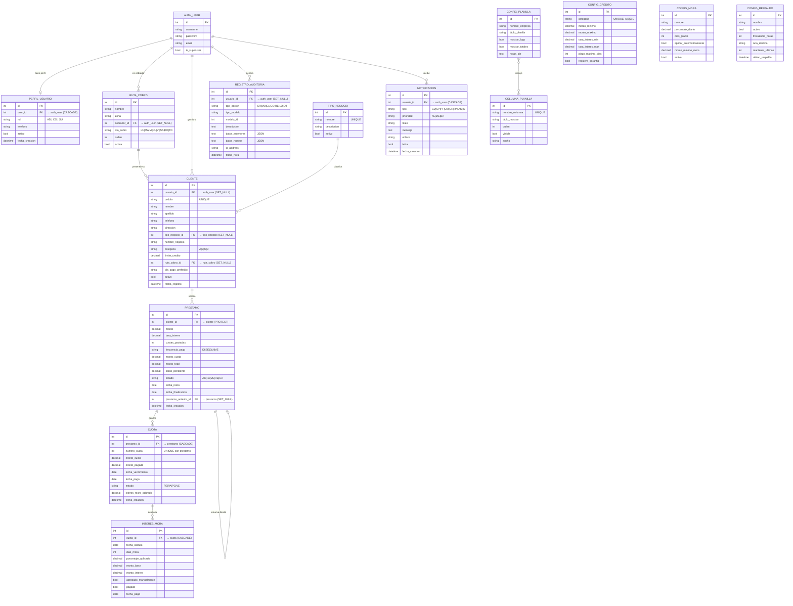

# 🗄️ PrestaFácil - Estructura de Base de Datos

Documentación completa del esquema de base de datos del sistema de préstamos.

---

## 📊 Diagrama de Relaciones (ER)



---

## 🔗 Resumen de Relaciones

### Flujo principal del negocio

```
Usuario (cobrador) → gestiona → Clientes → solicitan → Préstamos → generan → Cuotas
```

### Tabla de Foreign Keys

| Tabla Origen | Campo | Tabla Destino | on_delete | Descripción |
|---|---|---|---|---|
| `PerfilUsuario` | `user` | `auth_user` | **CASCADE** | Si se borra el user, se borra el perfil |
| `RutaCobro` | `cobrador` | `auth_user` | **SET_NULL** | Ruta queda sin cobrador asignado |
| `Cliente` | `usuario` | `auth_user` | **SET_NULL** | Cliente queda sin cobrador |
| `Cliente` | `tipo_negocio` | `TipoNegocio` | **SET_NULL** | Cliente queda sin tipo |
| `Cliente` | `ruta_cobro` | `RutaCobro` | **SET_NULL** | Cliente queda sin ruta |
| `Prestamo` | `cliente` | `Cliente` | **PROTECT** | ⛔ No se puede borrar cliente con préstamos |
| `Prestamo` | `prestamo_anterior` | `Prestamo` | **SET_NULL** | Cadena de renovaciones |
| `Cuota` | `prestamo` | `Prestamo` | **CASCADE** | Si se borra préstamo, se borran cuotas |
| `InteresMora` | `cuota` | `Cuota` | **CASCADE** | Si se borra cuota, se borran sus moras |
| `RegistroAuditoria` | `usuario` | `auth_user` | **SET_NULL** | Log permanece sin usuario |
| `Notificacion` | `usuario` | `auth_user` | **CASCADE** | Si se borra user, se borran sus notificaciones |

### Reglas de protección importantes

- 🛡️ **PROTECT en Prestamo → Cliente**: No podés eliminar un cliente que tenga préstamos asociados. Hay que cancelar/eliminar los préstamos primero.
- 🔄 **CASCADE en Cuota → Prestamo**: Al eliminar un préstamo, todas sus cuotas se eliminan automáticamente.
- 🔄 **CASCADE en InteresMora → Cuota**: Al eliminar una cuota, se eliminan sus registros de mora.
- ⚡ **SET_NULL en Cliente → Usuario**: Si se elimina un usuario del sistema, los clientes que tenía asignados quedan sin cobrador pero no se pierden.

---

## 📋 Valores de los campos Choice

### Estados de Préstamo (`Prestamo.estado`)
| Código | Valor | Significado |
|---|---|---|
| `AC` | Activo | Préstamo en curso con cuotas por cobrar |
| `PA` | Pagado | Todas las cuotas fueron cobradas |
| `VE` | Vencido | Tiene cuotas vencidas sin pagar |
| `RE` | Refinanciado | Se renovó en un nuevo préstamo |
| `CA` | Cancelado | Cancelado manualmente |

### Estados de Cuota (`Cuota.estado`)
| Código | Valor | Significado |
|---|---|---|
| `PE` | Pendiente | Aún no se ha cobrado |
| `PA` | Pagada | Cobrada completamente |
| `PC` | Parcialmente Cobrada | Se cobró una parte |
| `VE` | Vencida | Pasó la fecha y no se cobró |

### Frecuencia de Pago (`Prestamo.frecuencia_pago`)
| Código | Valor | Días entre cuotas |
|---|---|---|
| `DI` | Diario | 1 día |
| `SE` | Semanal | 7 días |
| `QU` | Quincenal | 15 días |
| `ME` | Mensual | 30 días |

### Categoría de Cliente (`Cliente.categoria`)
| Código | Significado | Descripción |
|---|---|---|
| `A` | Excelente | Historial impecable de pagos |
| `B` | Bueno | Buen pagador con algún atraso menor |
| `C` | Regular | Atrasos frecuentes |
| `D` | Nuevo | Sin historial |

### Roles de Usuario (`PerfilUsuario.rol`)
| Código | Rol | Permisos |
|---|---|---|
| `AD` | Administrador | Acceso total al sistema |
| `SU` | Supervisor | Gestión de cobros y reportes |
| `CO` | Cobrador | Solo cobros y consultas |

### Tipos de Notificación (`Notificacion.tipo`)
| Código | Significado |
|---|---|
| `CV` | Cuota Vencida |
| `CP` | Cuota por Vencer |
| `PF` | Préstamo Finalizado |
| `CM` | Cliente Moroso |
| `CR` | Cobro Realizado |
| `RN` | Renovación |
| `AS` | Alerta del Sistema |
| `IN` | Información |

### Tipos de Auditoría (`RegistroAuditoria.tipo_accion`)
| Código | Significado |
|---|---|
| `CR` | Creación |
| `MO` | Modificación |
| `EL` | Eliminación |
| `CO` | Cobro |
| `RE` | Renovación |
| `LO` | Login |
| `OT` | Otro |

---

## 📇 Índices de la Base de Datos

| Tabla | Campos del Índice | Tipo |
|---|---|---|
| `Cliente` | `cedula` | UNIQUE |
| `Prestamo` | `-fecha_creacion` | INDEX |
| `Prestamo` | `estado` | INDEX |
| `Prestamo` | `cliente, estado` | INDEX compuesto |
| `Cuota` | `prestamo, numero_cuota` | UNIQUE TOGETHER |
| `Cuota` | `fecha_vencimiento` | INDEX |
| `Cuota` | `estado` | INDEX |
| `Cuota` | `prestamo, estado` | INDEX compuesto |
| `RegistroAuditoria` | `-fecha_hora` | INDEX |
| `RegistroAuditoria` | `tipo_accion` | INDEX |
| `RegistroAuditoria` | `usuario` | INDEX |
| `RegistroAuditoria` | `tipo_modelo, modelo_id` | INDEX compuesto |
| `TipoNegocio` | `nombre` | UNIQUE |
| `ConfigCredito` | `categoria` | UNIQUE |
| `ColumnaPlanilla` | `nombre_columna` | UNIQUE |

---

## 🔢 Conteo de Tablas: 15

| # | Tabla Django | Tabla en PostgreSQL |
|---|---|---|
| 1 | `PerfilUsuario` | `core_perfilusuario` |
| 2 | `RutaCobro` | `core_rutacobro` |
| 3 | `TipoNegocio` | `core_tiponegocio` |
| 4 | `ConfiguracionCredito` | `core_configuracioncredito` |
| 5 | `ColumnaPlanilla` | `core_columnaplanilla` |
| 6 | `ConfiguracionPlanilla` | `core_configuracionplanilla` |
| 7 | `Cliente` | `core_cliente` |
| 8 | `Prestamo` | `core_prestamo` |
| 9 | `Cuota` | `core_cuota` |
| 10 | `RegistroAuditoria` | `core_registroauditoria` |
| 11 | `Notificacion` | `core_notificacion` |
| 12 | `ConfiguracionRespaldo` | `core_configuracionrespaldo` |
| 13 | `ConfiguracionMora` | `core_configuracionmora` |
| 14 | `InteresMora` | `core_interesmora` |
| 15 | `ConfiguracionPlanilla_columnas` | M2M intermedia (auto) |

> ℹ️ Además existen las tablas estándar de Django: `auth_user`, `auth_group`, `auth_permission`, `django_session`, `django_migrations`, `django_content_type`, `django_admin_log`.
